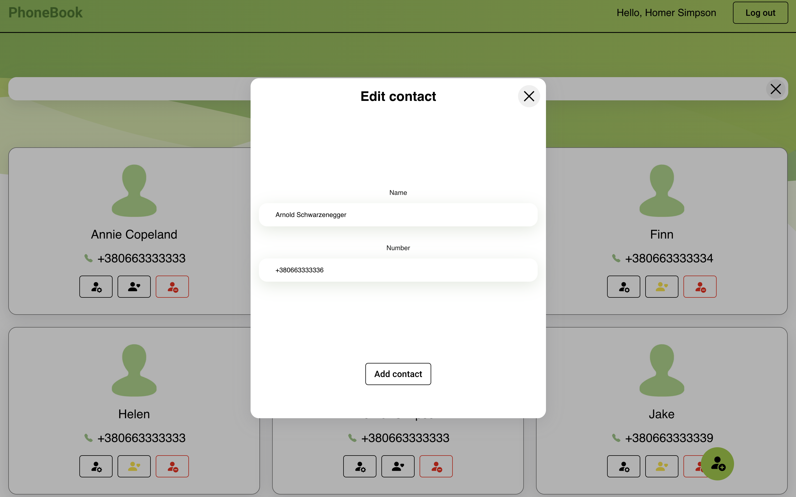
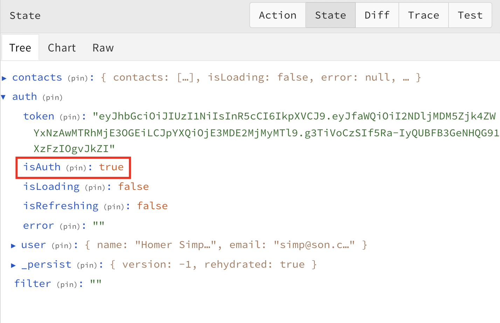
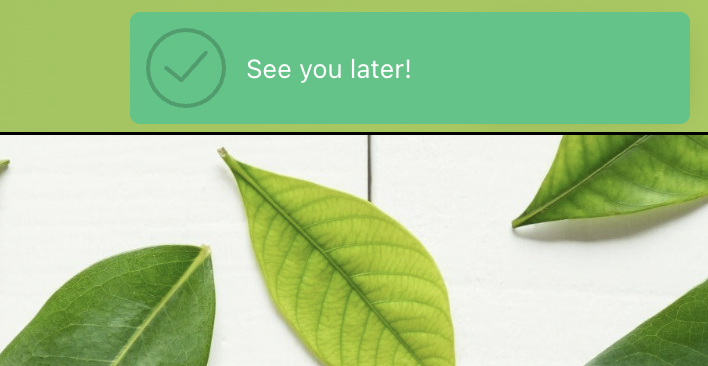
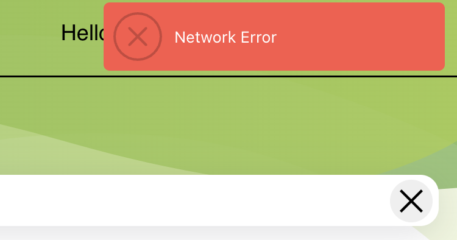

<h1><a href="https://nikitasimakov.github.io/Phonebook/">The Phonebook app</a></h1>

Книга контактов - это приложение, меняющее взгляд на хранение контактов. Это не просто список номеров - это отражение нас самих. Здесь каждая запись оживает, отображая общие интересы и проекты, создавая живые портреты наших связей для более глубокого и личного общения.

## О проекте

---

Мой проект, `Phonebook`, использует передовые технологии для управления
контактами. Разработанный на TypeScript с использованием библиотеки React, он
также включает Redux Toolkit для управления состоянием приложения. В части
обработки асинхронных запросов и взаимодействия с REST API были задействованы
Redux Toolkit и библиотека Axios, обеспечивая быстрый доступ и эффективное
хранение информации о контактах. Это создает удобный и простой в использовании
инструмент для управления связями и контактами.

Из-за ограниченных возможностей серверной части, для хранения избранных
контактов и служебной информации о пользователе в моем проекте была использована
библиотека redux-persist. Она обеспечивает сохранение данных о избранных
контактах и служебной информации локально в приложении, что позволяет
предоставлять более устойчивый и непрерывный доступ к этим данным даже при
ограниченной функциональности сервера.

Дополнение об адаптивной и респонсивной верстке:

Приложение также разработано с использованием адаптивной и респонсивной верстки.
Точки перелома установлены от 260px до 767px, и от 768px до 1024px, что
обеспечивает оптимальное отображение контента на различных устройствах и
разрешениях экрана. Это гарантирует, что пользователи могут комфортно
использовать приложение на мобильных устройствах, планшетах и настольных
компьютерах, получая приятных пользовательский опыт вне зависимости от
используемого устройства.

---

Приветственная страница создана для приятного первого впечатления: она встречает
пользователя элегантным логотипом, привлекательным дизайном и предлагает кнопку
для перехода на страницу авторизации.

Страницы регистрации и авторизации включают переиспользуемые функциональные
компоненты React, содержащие формы, созданные на основе библиотеки Formik для
управления вводимыми данными. Проверка корректности введенной информации
осуществляется с помощью Yup, обеспечивая надежность и точность данных в формах.

---

На странице контактов после входа в систему пользователь видит:

1. **Хедер:**

   - Логотип;
   - Имя авторизованного пользователя;
   - Кнопка "Log Out" для выхода из системы. При ее нажатии происходит очистка
     текущего состояния Redux и отправка запроса на сервер для выхода.

2. **Форма поиска:**

   - Поле для поиска с кнопкой "Очистить" для удаления текста поиска;
   - Кнопки выбора отображаемых карточек контактов: "All" или "Favorites".

3. **Карточки контактов:**

   - Каждая карточка содержит имя и номер телефона контакта;
   - Функциональный блок с кнопками: "Edit" (Редактировать), "Favorites"
     (Добавить в избранное), "Remove" (Удалить).

4. **Кнопка добавления нового контакта:**
   - Расположена в правом нижнем углу страницы для добавления новых контактов.

---

При нажатии на кнопку `"Add contact" \ "Edit contact"` открывается модальное
окно, которое рендерится с использованием функции `createPortal`.

Это позволяет создавать модальное окно или всплывающие элементы вне иерархии DOM
текущего компонента, что упрощает их управление и взаимодействие с другими
частями приложения. Модальное окно, созданное с помощью `createPortal`, может
содержать форму или другие элементы, не пересекаясь с основным содержимым
страницы.

Формы в модальном окне `"Edit contact"` также контролируются с помощью библиотек
Formik и Yup. При открытии модального окна форма автоматически заполняется
данными редактируемого контакта из состояния Redux. Это обеспечивает удобство
пользователя при редактировании контактной информации, предварительно заполняя
поля формы данными, которые уже есть в системе.

Функциональные компоненты модальных окон в React разработаны с учетом
переиспользуемости, что позволяет легко создавать множество различных модальных
окон с минимальным объемом кода и логики. Благодаря этой архитектуре, создание
новых модальных окон становится гибким и удобным, так как используется общая
логика и компоненты, минимизируя дублирование кода. Это упрощает добавление и
настройку новых функциональных модальных окон в приложении.

Когда пользователь нажимает кнопку "Favorite", данные о контакте сохраняются в
локальном хранилище (localStorage) браузера с использованием библиотеки
redux-persist. Это позволяет сохранять список избранных контактов в памяти
браузера на протяжении продолжительного времени, даже после перезагрузки
страницы или закрытия браузера. Благодаря сохраненным данным в localStorage
пользователь может сохранить свои предпочтения относительно избранных контактов
для последующего использования.

---

В приложении настроена маршрутизация с помощью библиотеки React Router Dom.
Приватные и публичные маршруты управляются в зависимости от статуса
пользователя - авторизован он или нет. Информация о статусе авторизации
сохраняется в состоянии Redux.

Это позволяет авторизованным пользователям использовать приложение, не тратя
время на повторную авторизацию, тогда как неавторизованные пользователи
направляются на страницу авторизации или регистрации. Эффективное управление
маршрутами через React Router Dom и состоянием авторизации в Redux обеспечивает
удобство использования приложения и сохранение времени пользователей.

---

С помощью библиотеки Notiflix создается максимально комфортная и информативная
атмосфера в приложении. Она используется для предоставления пользователю
информации о успешности или неуспешности запросов, отправляемых на сервер. Эти
уведомления обеспечивают пользователя информацией о статусе операции, например,
успешном сохранении данных или возникших проблемах при запросе к серверу, что
помогает создать более удобный пользовательский опыт. Для еще большего удобства
добавлены индикаторы загрузки асинхронных процессов в кнопках. Эти индикаторы
загрузки обеспечивают пользователю визуальную информацию о текущем статусе
операции - например, о процессе отправки данных на сервер. Это позволяет
пользователям увидеть, что происходит в приложении в реальном времени, что важно
для комфортного пользовательского опыта.
